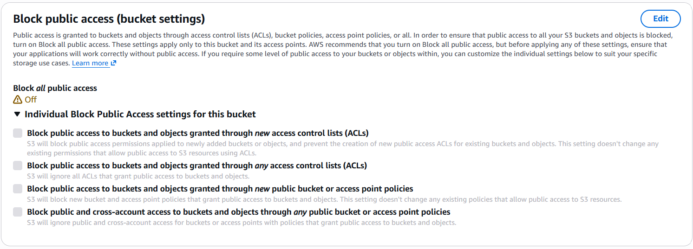
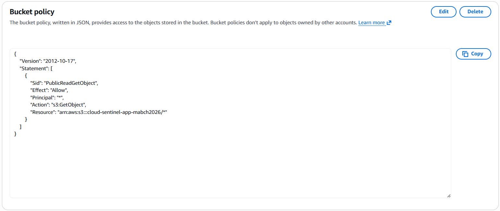
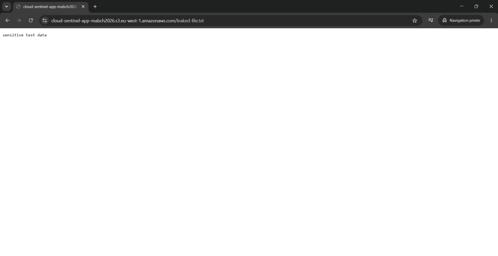
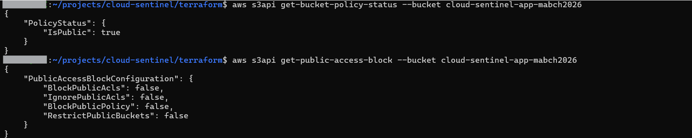
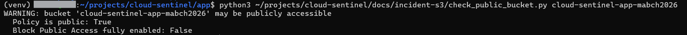
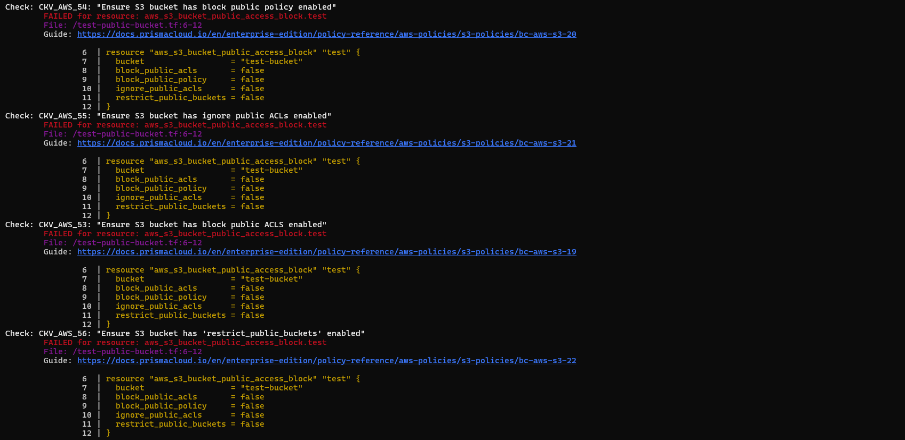
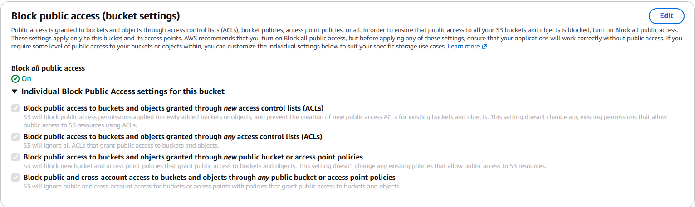
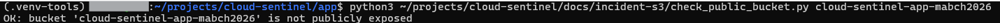
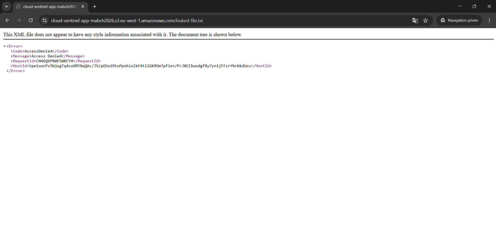

# Incident: Public S3 Bucket

## Description
Simulated a common cloud misconfiguration: an S3 bucket accidentally
exposed to the public internet the same pattern behind the Capital
One breach (2019).

### Initial state
Block Public Access was fully enabled on the application bucket before
the simulated incident.


## Attack / Misconfiguration
1. Disabled Block Public Access (all 4 settings) on the application bucket
2. Applied a public bucket policy granting `s3:GetObject` to `Principal: "*"`




## Potential Impact
Any file in the bucket becomes downloadable by anyone on the internet,
with no authentication required. In the Capital One case this pattern
(combined with an SSRF vulnerability) exposed over 100 million customer
records.

## Investigation
Verified public access by requesting the object directly, unauthenticated,
from a private browser session — confirming real-world exploitability,
not just a theoretical misconfiguration.



## Detection

### Manual
```bash
aws s3api get-bucket-policy-status --bucket <bucket>
aws s3api get-public-access-block --bucket <bucket>
```



### Automated
A small Python script (`check_public_bucket.py`) checks both the bucket
policy status and the Block Public Access configuration, exiting with
code 1 if the bucket may be exposed.



### What Checkov would have caught
Reproducing the exact misconfiguration in Terraform and scanning it with
Checkov immediately flags 4 findings:

- `CKV_AWS_53`: Ensure S3 bucket has block public ACLs enabled
- `CKV_AWS_54`: Ensure S3 bucket has block public policy enabled
- `CKV_AWS_55`: Ensure S3 bucket has ignore public ACLs enabled
- `CKV_AWS_56`: Ensure S3 bucket has restrict public buckets enabled



This demonstrates the value of shifting security left: catching this
class of error in CI, before deployment, rather than after.

## Remediation
1. Re-enabled all 4 Block Public Access settings
2. Removed the public bucket policy



## Verification
Re-ran the automated script — confirmed `OK` status. Re-attempted the
direct public URL access — received an access denied error.




Also confirmed no Terraform drift after the manual remediation —
`terraform plan` showed no changes, since Block Public Access is
already hardcoded to `true` in this project's actual Terraform code.

## Prevention
This exact misconfiguration is structurally prevented in this project's
real Terraform code: `block_public_acls`, `block_public_policy`,
`ignore_public_acls`, and `restrict_public_buckets` are all hardcoded
to `true` in `modules/storage/main.tf`, and Checkov runs on every push
via the CI pipeline to catch this class of misconfiguration before it
ever reaches AWS.

## Lessons Learned
- Block Public Access is a bucket-level lock that survives even a bad
  bucket policy applied later — defense in depth in practice, not just
  theory.
- Deleting a bucket policy manually via CLI (`delete-bucket-policy`)
  removes ALL policies on the bucket, not just the malicious one —
  this accidentally removed the legitimate CloudTrail write policy too.
  `terraform plan` immediately caught this drift, recreating exactly
  what was missing. A good reminder that manual remediation during an
  incident should always be followed by a Terraform drift check.


